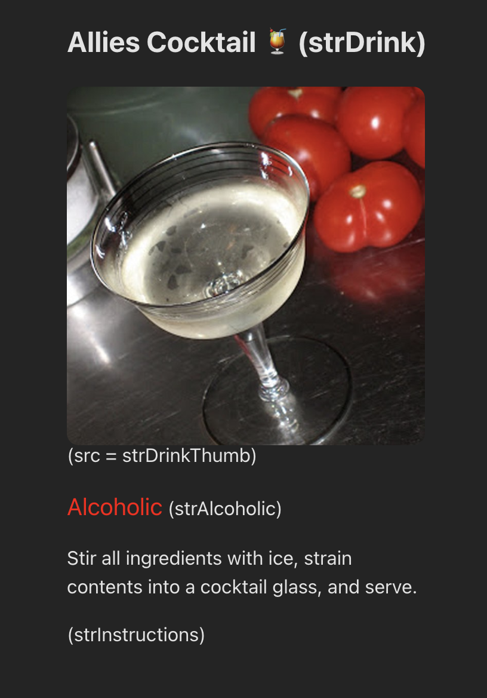

### 5) useEffect con tipos

1. crear un componente nuevo
2. hacer un llamado al endpoint usando useEffect: `https://www.thecocktaildb.com/api/json/v1/1/random.php`
3. crear un estado para guardar la bebida
4. crear un estado para guardar el loading
5. definir el tipo de la respuesta del endpoint
6. definir el tipo de la bebida
7. mostrar la bebida en el componente. Recomendado:
   
8. mostrar un mensaje de loading mientras se carga la bebida.

nota: recordar darle tipos a los estados.
